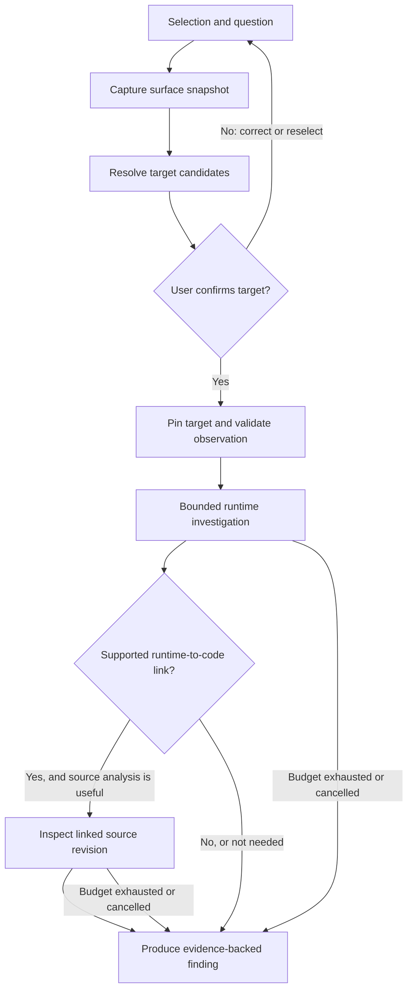

# Simurgh — Product and Technical Design

**Status:** Product and implementation design; see [current Phase 1 status](docs/phase1-status.md) for delivered behavior, validation, and known deviations. This document preserves the intended product scope; it is not a claim that all described capabilities are implemented.\
**Created:** October 6, 2026\
**Updated:** October 9, 2026\
**Product name:** Simurgh\
**Companion glossary:** [CONTEXT.md](CONTEXT.md)

> Point to something. Ask about it. Give your existing agent the evidence it needs.

Simurgh connects what a person selects on a dashboard or in an editor to structured, permission-checked evidence for their existing AI agent. It preserves the selected object's identity, scope, and relevant time or version throughout a bounded investigation.

This document captures the agreed product direction, the approved Phase 1 context-inspector scope, and the broader product design. Later delivery details and technology recommendations are labeled; they are not claims that an integration has been implemented or validated.

The Phase 1 design originally called for geometric selection of a plotted region. The accepted development flow uses Grafana's native time-range zoom and panel-menu capture. A version-pinned freehand overlay prototype has passed the combined local real-browser checks and a live cross-surface test, including chart-change rejection and narrow viewport checks. This verifies the local experimental MVP scope, not production readiness or compatibility beyond the pinned renderer. See [Phase 1 status](docs/phase1-status.md) for the exact boundary and evidence.

## Contents

- [1. Product definition](#1-product-definition)
- [2. Scope and non-goals](#2-scope-and-non-goals)
- [3. Canonical user journey](#3-canonical-user-journey)
- [4. Selection and confirmation](#4-selection-and-confirmation)
- [5. Investigation behavior](#5-investigation-behavior)
- [6. Shared context model](#6-shared-context-model)
- [7. Architecture and integration roles](#7-architecture-and-integration-roles)
- [8. Integration contracts](#8-integration-contracts)
- [9. Budgets, cancellation, and stopping](#9-budgets-cancellation-and-stopping)
- [10. Security and data handling](#10-security-and-data-handling)
- [11. Findings and user experience](#11-findings-and-user-experience)
- [12. Acceptance scenarios](#12-acceptance-scenarios)
- [13. Validation and delivery boundaries](#13-validation-and-delivery-boundaries)
- [14. Decisions and unresolved choices](#14-decisions-and-unresolved-choices)
- [15. Sources and competitive context](#15-sources-and-competitive-context)

## 1. Product definition

### 1.1 The problem

A person can see the thing they want to ask about, but their AI agent does not necessarily know what that thing is.

A screenshot of a CPU chart omits its effective query, selected series, dashboard variables, sampling resolution, and datasource identity. A pasted function may omit its types, references, surrounding source version, and relationship to deployed behavior. Manually assembling this information is slow, error-prone, and easy to repeat incorrectly across applications.

Simurgh turns an indication such as “this spike” or “this function” into an explicit, confirmed reference. It then supplies relevant evidence progressively instead of sending an unrestricted screen recording, repository dump, or log stream to the model.

### 1.2 Agreed product direction

- **Bring your own agent.** Simurgh wraps or integrates with the user's existing coding/general-purpose AI environment. It is not a replacement coding agent.
- **Point and ask.** Users select, click, or circle something and ask a question through speech or text.
- **Use application semantics.** Dashboard metadata and editor/language-server information are preferred over asking a vision model to reconstruct information the application already knows.
- **Confirm intent.** The user accepts or corrects Simurgh's interpretation before an investigation begins.
- **Investigate within limits.** Evidence retrieval and reasoning have explicit time and model-usage budgets. An inconclusive result is legitimate.

The product covers both dashboard and editor surfaces. Connecting references across those surfaces is important, but selecting two objects does not establish that one caused the other.

Phase 1 proves dashboard reference resolution without an LLM, voice transport, or editor integration. Those capabilities remain in the product direction and enter in the phased sequence in Section 13.

### 1.3 Primary users and first scenario

The first scenario is a CTO or engineer inspecting a production Grafana dashboard backed by the LGTM stack: Loki, Grafana, Tempo, and Mimir. The person sees a brief CPU spike, selects it, and asks why it occurred and disappeared.

The user's role does not grant Simurgh additional privileges. All reads use an explicitly configured identity and authorized scope.

A second core scenario is selecting a function in an editor, asking about it, and optionally relating it to a previously pinned metric or runtime event.

### 1.4 Product responsibility

**Simurgh owns reference resolution, evidence provenance, access constraints, and investigation controls. The existing agent owns general reasoning and planning within those constraints.**

The intended experience is “the agent knows what I mean.” The implementation must make that knowledge explicit and inspectable rather than treating the model's interpretation as fact.

## 2. Scope and non-goals

### 2.1 Product capabilities

| Capability | Intended behavior |
|---|---|
| Dashboard selection | Resolve a selected panel/series/time interval to its effective measurement and affected entities. |
| Editor selection | Preserve a source range and version; enrich it with available language-aware context. |
| Conversation | Associate speech or text with the intended selection; preserve references across follow-up questions. |
| Evidence access | Retrieve authorized metrics, logs, traces, optional profiles, and source information with explicit provenance and limits. |
| Cross-surface reasoning | Let the agent discuss a selected metric and source location together without fabricating a runtime-to-code link. |
| Findings | Return supported explanations, tentative hypotheses, or inconclusive results with evidence and limitations. |

### 2.2 Non-goals

Simurgh is not intended to build a new LLM, language server, observability backend, or general-purpose coding-agent runtime. It should reuse those capabilities through adapters.

The initial investigation design is **read-only**. Target confirmation does not authorize deployment changes, code edits, shell execution, incident publication, or production remediation. Any later action-taking workflow requires its own authorization and approval design.

Other non-goals are universal interpretation of arbitrary uninstrumented screens, guaranteed root-cause attribution, reconstruction of telemetry that was never collected, and automatic collection of every application visible on the desktop.

## 3. Canonical user journey

This is the full product journey. Phase 1 ends with a confirmed, inspectable context bundle; agent investigation and spoken interaction enter in later phases.

### 3.1 The CTO's CPU-spike investigation

1. The CTO opens a production dashboard and sees what appears to be a spike lasting about five seconds.
2. They activate Simurgh, click or circle the spike, and ask: “Why does this spike last five seconds and then disappear?”
3. Simurgh captures the selected surface state, resolves candidate targets, and obtains the minimum authorized metadata needed to explain its interpretation.
4. Simurgh shows the dashboard, panel, selected series/entities, effective measurement, and absolute time interval. The user confirms or corrects the target.
5. The confirmed target is pinned. Simurgh validates what the chart actually establishes and opens a bounded investigation through the existing agent.
6. The agent retrieves relevant runtime evidence. Associated logs are a sensible first step when available, but CPU profiles, related metrics, traces, or operational events may be more informative.
7. If runtime evidence connects the event to source code, the agent inspects bounded source context at the appropriate deployed revision. Otherwise, any code-based explanation remains a hypothesis.
8. Simurgh presents the finding, evidence, contradictory observations, limitations, and next discriminating check. It stops when the question is answered, the user cancels, or a limit is reached.

### 3.2 Control flow

Failures during capture or resolution do not enter an investigation with a guessed target. They return an actionable resolution error or a set of candidates for the user to distinguish.

### 3.3 Conversational state

The session progresses through capture, resolution, confirmation, investigation, and reporting. A confirmed reference persists separately from the current viewport or cursor position.

A follow-up question can reuse pinned references. A new selection does not silently replace one used by an active investigation. The UI asks whether to add a reference, replace it for a new investigation, or cancel the current work.

The execution outcome and evidence strength are separate. For example, an investigation may stop because its budget expired while still returning a useful but tentative finding.

## 4. Selection and confirmation

### 4.1 Dashboard selection

A DOM locator can identify a panel container, but it is not sufficient evidence of the plotted series or datapoints. A graph may be canvas-rendered, show multiple overlapping series, transform datasource results, or aggregate several entities.

The Grafana adapter should combine the selection geometry with the captured panel state and data. A circle may indicate a time region rather than a single point. When multiple interpretations remain, show candidates rather than selecting one silently.

The target snapshot must retain:

| Area | Required context when applicable |
|---|---|
| Identity | Grafana instance/organization, dashboard UID, panel ID, datasource UID/type. |
| Measurement | Effective query or structured target, resolved variables, units, aggregation/rate semantics, transformations and relevant field configuration. |
| Entities | Selected series labels and the actual level of aggregation: host, pod, process, service, or a group. |
| Time | Captured absolute range, selected interval, timezone, panel-relative time/shift settings, and observation time. |
| Resolution | Query step, relevant sampling information when discoverable, averaging/rate window, and displayed result snapshot or reproducible evidence reference. |

Relative ranges such as “last 15 minutes” must be resolved when captured. Repeating that phrase later is not equivalent to querying the original interval.

Freeze the relevant view state and identify the data revision being resolved. If the view changes before resolution finishes, discard the stale result or clearly retain the earlier snapshot; do not combine coordinates from one rendering with data from another.

### 4.2 Editor selection

Capture the workspace/repository identity, file URI or repository-relative path, selected range, current document version, and available revision information. Preserve the selected text or an authorized local snapshot so an unsaved buffer is not later confused with disk contents.

The editor adapter can enrich that selection with enclosing symbols, hover/type information, definitions, references, diagnostics, and call hierarchy when supported. An arbitrary selection may span several symbols; the adapter must not force every selection into one function.

Use capability negotiation. Unsupported or incomplete language-server results are coverage limitations, not proof that a symbol has no callers or dependencies. Source locations and symbol names must remain bound to their document versions; they are not globally stable identifiers across edits and renames.

### 4.3 Confirmation card

The card answers: **“What do you believe I selected, and what will you investigate?”**

An illustrative card might show:

> **Dashboard:** Production overview\
> **Panel:** Node CPU utilization\
> **Scope:** node-7, production\
> **Selected window:** 14:32:10–14:32:15 UTC\
> **Calculation:** Resolved CPU query, with averaging window and units\
> **Resolution note:** Available samples may not establish an event duration of five seconds\
> **Actions:** Confirm; correct series/scope/time; select again; cancel

Exact queries, source metadata, and any unresolved variables should be inspectable without overwhelming the default card.

Confirmation is bound to a particular target snapshot. Changing the target's identity or materially expanding entity scope requires confirmation again. The initial card may include a clearly described allowance for surrounding time context and a comparison window; later reads must stay within the confirmed investigation scope.

### 4.4 Selection and speech timing

**Phase 1 interaction:** explicit selection, correction/confirmation, and context inspection without a model. Phase 2 adds typed questions to an existing agent; Phase 3 adds voice. When speech is introduced, preserve the selection snapshot for the utterance even if the pointer moves while the user speaks.

Fully ambient interpretation of “that” during a continuously changing screen share is a more difficult interaction and should not be required to prove the core product. Voice playback interruption should stop speech without being confused with cancellation of the entire investigation. An explicit stop action cancels investigation work.

## 5. Investigation behavior

### 5.1 Validate the observation before explaining it

Separate the selected window from the event's actual duration. A user can select a five-second region even when the metric cannot resolve events at that granularity.

Check units, aggregation, baseline, missing data, effective query resolution, and relevant rate windows. A CPU counter sampled every 15 seconds does not by itself establish that CPU consumption increased for precisely five seconds. Re-querying at a smaller display step does not create missing measurements.

The first output of this stage is a bounded description of what changed, for which entities, by how much, and at what available resolution. If the apparent spike is an aggregation or rendering effect, explain that with the source data instead of searching for an unrelated code defect.

### 5.2 Correlate by identity and time

Time is necessary but insufficient. Evidence must be scoped to the affected environment and workload using reliable labels or configured mappings. Even if a dashboard supplies a logs panel, it does not follow that all of those logs explain the selected host's CPU.

Use the selected interval, limited surrounding context, and a meaningful comparison window. Preserve original timestamps while normalizing queries to an explicit timezone. Record known clock differences or uncertainty across sources rather than inventing an exact ordering.

A host-level spike may involve another container or process. A service-wide aggregate may hide one unhealthy instance. Narrow the relevant entity before attributing behavior to application code.

### 5.3 Choose evidence according to the question

| Evidence | Useful questions | Important limitation |
|---|---|---|
| Related metrics | Did load increase? Which instances changed? Was the workload CPU-bound, throttled, or affected by host contention? | Correlation and aggregation alone do not establish a cause. |
| Logs and operational events | Did a scheduled task, retry storm, restart, deployment, or runtime event occur? | Successful CPU-heavy work may emit no diagnostic log. No matching log is not proof that nothing happened. |
| Traces | Which instrumented operations occurred, and where did elapsed time go? | Sampling and instrumentation limit coverage; elapsed time is not equivalent to CPU time. |
| CPU profiles | Which sampled stacks consumed CPU during the relevant period? | Requires available profiling data; sampling and aggregation still limit attribution. |
| Source and deployment metadata | Which implementation was deployed, and how could the linked operation behave? | Source inspection alone does not establish that the code executed during the event. |

Logs-first is a configurable default when the dashboard provides a reliable workload mapping, not an invariant. For a CPU question, available profiling data may be a shorter path to useful evidence. Pyroscope or another profiler is optional; the LGTM stack alone does not imply profiles exist.

### 5.4 Hypothesis-driven retrieval

The existing agent can maintain an investigation plan, but each proposed check should connect a hypothesis to a discriminating observation. A check identifies its target, permitted sources, expected supporting or opposing evidence, and budget cost.

For example: “A periodic task caused the spike” suggests checking task start/end events on the affected workload, the task's work volume, comparison runs, and any associated profiles. It does not justify scanning an entire repository for expensive-looking loops.

Retrieve compact summaries and bounded excerpts first. Expand a promising observation only when it helps distinguish competing explanations. Record truncation, query errors, unavailable sources, and negative results with their actual coverage.

### 5.5 Escalate to code with an explicit basis

Useful runtime-to-code links include a profile stack, an instrumented trace span, a logged job identifier with a known handler mapping, or a deployed route-to-handler association. Their evidentiary strength differs and must remain visible.

Use the deployed revision when available. If the editor shows a different commit or unsaved changes, preserve both identities and state the mismatch. Do not silently inspect the latest branch as though it were the production implementation.

LSP enrichment helps navigate and understand source. It does not reconstruct execution history or guarantee complete dynamic call graphs. A code location directly selected by the user may be analyzed without runtime attribution, but a claim that it caused the selected production event still requires supporting evidence.

### 5.6 Stop without manufacturing certainty

A finding can be a supported explanation, a tentative hypothesis, or inconclusive. Do not assign a numerical confidence percentage unless there is a defined calibration method.

Repeated evidence retrieval without a discriminating hypothesis should stop. Missing instrumentation, insufficient temporal resolution, inaccessible data, or budget exhaustion can all prevent attribution. Report the gap and the smallest useful next check, rather than treating plausible code as proof.

## 6. Shared context model

The following are logical records, not a finalized serialization schema. The glossary defines their product meaning.

### 6.1 Target snapshot

| Field group | Meaning |
|---|---|
| Reference identity | Opaque selection/snapshot identifiers and a display label; not credentials. |
| Origin | Surface, configured integration, workspace/organization, and authenticated principal context. |
| Locator | Dashboard/panel/series identity or repository/file/range, with the appropriate domain-specific details. |
| Captured state | Time interval and view state for dashboards; document version, revision, and relevant buffer state for code. |
| Resolution status | Resolved, ambiguous, stale, unavailable, or unsupported, with reasons. |
| Confirmation | The accepted snapshot and scope, person confirming, and confirmation time. |
| Retrieval capabilities | The evidence types the adapter can actually supply under current permissions and instrumentation. |

Dashboard and editor targets share an envelope but retain typed domain details. Do not invent one universal identifier that hides the difference between a metric series and a function.

### 6.2 Evidence item

An evidence item contains a stable investigation-local identifier, source locator, query or retrieval description, entity/time/revision scope, retrieval time, payload or authorized payload reference, and applicable limitations. It also records redaction and truncation without leaking the removed content.

A derived summary cites the underlying evidence items. It must not replace them as the sole basis for an important claim. Query text can itself contain sensitive labels and is subject to the same disclosure policy as results.

### 6.3 Investigation record

An investigation binds the question, confirmed references, authorized scope, selected agent-host session, budget policy, evidence ledger, hypotheses, execution outcome, and final finding.

Keep termination reason separate from finding category. Preserve enough provenance to revisit an answer, but do not require full raw-log or audio retention merely to support a history view.

## 7. Architecture and integration roles

### 7.1 Selected Phase 1 deployment: extension and plugin together

**Agreed:** Phase 1 is one hybrid workflow requiring both the browser extension and the Grafana plugin. They have complementary responsibilities and use one shared context model and confirmation flow.

| Part | Responsibility |
|---|---|
| Browser extension | Activation, selection/circle overlay, capturing what the person indicated, and the Simurgh interaction UI. |
| Grafana plugin | Grafana-native entry points and structured context available through supported integration hooks and authorized reads. |
| Shared context module | Target identity, snapshots, ambiguity handling, confirmation, and the inspectable context bundle. |

This does not commit Phase 1 to extension-only or plugin-only operation. Those would be separate support modes. If either required part is unavailable or incompatible, show the missing prerequisite rather than silently switching to a less reliable interpretation.

A Grafana plugin does not automatically expose every existing chart's data or hover/selection state. The first technical check must establish what the actual built-in time-series panel exposes on the selected Grafana version. Do not replace it with a custom Simurgh chart or rely on hardcoded metadata to make the demonstration pass.

The extension/plugin bridge must bind messages to the expected tab, origin, integration, selection, and snapshot revision. Validate message shape and scope; the page cannot use this bridge to request arbitrary privileged operations. The bridge's exact transport is selected after the supported Grafana hooks are inspected.

Both parts require installation and compatibility management. Sharing the context module avoids duplicated interpretation logic, but does not remove deployment, permission, and versioning work.

An editor extension, an agent-host bridge, and any local session coordinator enter when their phases require them. An embeddable SDK for other applications remains a possible later delivery form, not a Phase 1 prerequisite.

### 7.2 Modules and interfaces

| Module | Interface responsibility | Implementation it hides |
|---|---|---|
| Selection module | Capture a selection and its surface snapshot; return target candidates with resolution status. | Browser/editor event handling, coordinate-to-target resolution, domain adapters. |
| Context module | Confirm, pin, replace, and resolve references for a question. | Version tracking, stale-selection handling, reference relationships, progressive evidence assembly. |
| Evidence access module | Authorize and execute scoped evidence requests; return evidence items and coverage information. | Grafana API/MCP access, telemetry/source adapters, identity mapping, redaction, limits, provenance. |
| Agent bridge module | Start and control an investigation in the user's agent host; exchange evidence, usage, and findings. | Host-specific session, tool authorization, cancellation, and usage integration. |
| Presentation module | Show selection confirmation, live progress, pinned references, and evidence-backed findings. | Speech/text interaction, highlighted targets, query/source links, result navigation. |

Budget and policy checks occur before dispatching evidence or model work. They are not merely instructions inside the agent prompt.

This is the full product module map, not a requirement to create every module immediately. Phase 1 needs selection, context, presentation, and authorized panel-data access. It does not need empty agent, RTC, or editor modules.

### 7.3 RTC and collaboration

RTC is an interaction channel, not the context model. Text and voice requests should bind to the same confirmed references and use the same investigation rules.

For shared rooms, each selection and question must be associated with an authenticated participant. Room membership does not grant access to every participant's repositories or datasources. Evidence cannot be broadcast to a room unless its audience is authorized. Different participants' simultaneous selections remain separate.

The phased sequence introduces individual voice interaction in Phase 3 and shared/managed use in Phase 5. Multi-person sessions require explicit audience and permission semantics before release; room membership must never act as a permission shortcut.

### 7.4 Technology decisions by phase

**Choose the Phase 1 stack now, before its implementation plan; do not choose the entire future platform now.** The hybrid shape and target-resolution contract are settled enough to make a focused stack decision. The following are recommendations, not yet user-approved technology selections:

| Phase 1 concern | Recommended starting point | Reason |
|---|---|---|
| Browser-facing language and model | TypeScript with a host-independent selection/context module | Share browser-side snapshot contracts without importing Grafana or browser globals into the model. This does not select the future investigation coordinator's language. |
| User interface | React, using versions compatible with the selected Grafana tooling | Matches Grafana's app-plugin UI model; keep the confirmation behavior shared rather than building two competing interfaces. |
| Browser target | One Chromium browser using Manifest V3 | A bounded extension platform; other browser families remain unverified until deliberately supported. |
| Plugin/toolchain | A Grafana app plugin using official plugin tooling and a supported Node.js LTS release | Node is build/development tooling here, not a proposed Simurgh backend. Pin actual dependency versions when the Phase 1 stack is approved. |
| Development environment | Docker Compose with the pinned Grafana release and real CPU telemetry from one approved Prometheus-compatible datasource | A reproducible, controlled environment without requiring the entire LGTM stack to validate selection. |

No separate Simurgh backend, database, or hosted service is required by the Phase 1 acceptance contract. Add one only if a demonstrated integration or credential-handling requirement justifies it; do not move secrets into the browser merely to avoid a backend. Exact extension build tooling, workspace/package-manager choice, and bridge transport belong in the Phase 1 implementation plan after the capability check.

Phase 2 selects the first existing agent host, its tool/lifecycle interface, and any required coordinator runtime. Phase 3 selects voice/RTC and speech providers. Phase 4 selects the editor/language-server integration. Phase 5 addresses managed deployment, persistence, and shared-room delivery. These later choices are not global blockers for Phase 1.

### 7.5 Go and ScriptC: candidates, not a runtime decision

**Discussion recorded October 7, 2026:** Go and ScriptC are candidates for a component with demonstrated native or server-side responsibilities. Neither has been selected, installed, or tested for Simurgh. Choosing a native implementation does not itself establish that Phase 1 needs an additional process.

Keep three responsibilities distinct:

- **Browser-side selection:** capture application state and resolve what the person indicated. A native process does not grant access to otherwise unavailable Grafana panel state.
- **Context contract:** define explicit identities, snapshot versions, scope, and validation at boundaries. A shared TypeScript implementation is useful, but the wire contract must not depend on TypeScript-specific runtime behavior.
- **Investigation authority:** enforce authorized evidence access, budgets, cancellation, and the chosen agent host's lifecycle. A coordinator may own these responsibilities when the integration requires it.

| Candidate/location | Potential fit | Boundary or qualification |
|---|---|---|
| Go backend inside the Grafana plugin | Custom server-side authentication/authorization, resource endpoints, and service integration. | Grafana launches and manages the backend subprocess on the Grafana server. It does not thereby gain access to the browser user's local agent or repository. |
| Local Go companion | Local agent/process integration, credential handling, and bounded investigation coordination. | Requires an authenticated, scoped browser-to-companion bridge and explicit installation/lifecycle handling. Go alone does not make access or cancellation correct. |
| Local TypeScript companion compiled with ScriptC | Reuse suitable TypeScript context logic while distributing a native executable without requiring Node on the user's machine. | ScriptC is experimental and supports a subset of JavaScript/TypeScript/Node APIs. Compatibility must be established with the actual agent adapter and target operating systems. It is not a replacement for the browser/Grafana frontend toolchain. |

ScriptC's supported static code compiles to native instructions without a JavaScript engine. Its ordinary npm dependency path uses `--dynamic` to embed QuickJS-NG; experimental static package compilation is partial and can defer unsupported operations until runtime. A native executable therefore does not imply that every dependency was statically compiled or that a successful build proves the agent integration works.

Sharing TypeScript source does not establish identical runtime semantics. For example, ScriptC validates conversions such as `JSON.parse(input) as Config`, whereas ordinary browser/Node TypeScript assertions are erased. Other documented differences include record copying and static/embedded-engine scheduling. Use explicit validation at trust boundaries and verify behavior in every runtime used; do not rely on a compiler-specific cast to secure browser input.

**Selection gate:** when the first agent host is chosen, qualify the exact SDK/import graph and transport. Exercise streamed output, cancellation, child-process exit and failure cleanup where applicable, resource limits, and builds on the supported operating systems. Inspect ScriptC coverage for unsupported and dynamic paths, then run those paths; a compiler success or CPU microbenchmark is not sufficient evidence. Prefer Go if the required integration would otherwise demand substantial compiler-specific dependency rewrites. ScriptC remains a credible option if it handles that integration cleanly and sharing logic provides a concrete benefit.

Phase 1 remains focused on the context inspector. Bring a backend decision forward only for a demonstrated credential, authorization, or native-access requirement; do not introduce a coordinator solely to satisfy a language preference.

## 8. Integration contracts

### 8.1 Grafana and telemetry

Discover capabilities and datasource identity through the configured integration. Do not execute an arbitrary URL or query copied from untrusted page content with privileged credentials.

Where supported, reuse the panel's effective query rather than asking an LLM to recreate it. Resolve template variables, time overrides, query resolution, and displayed transformations. The same raw query at a different resolution can produce a different-looking result.

API and MCP access are alternative adapter implementations, not automatic guarantees of equivalent capabilities. Grafana's run-panel-query MCP tool is documented as disabled by default and requires dashboard-read and datasource-query permissions. If a capability is unavailable, disclose it; use another authorized route only if it preserves the intended semantics.

Logs, metrics, traces, and profiles may have different datasource identities, retention, permissions, and entity labels. Cross-source retrieval requires configured or verifiable mappings. A missing mapping becomes an evidence gap, not a license to query all tenants or all services.

### 8.2 Editor and language server

Prefer the editor's existing language capabilities and document lifecycle rather than starting an independent server with a divergent view of unsaved files. If direct LSP integration is necessary, respect capability negotiation, position encoding, synchronization, and request/version association.

Start with the selected range and local semantic context. Expand to definitions, references, callers, or related files only when the question warrants it. Test discovery and runtime attribution are separate capabilities; LSP does not automatically provide either in complete form.

### 8.3 Existing agent host

A supported managed-investigation adapter must expose the following capabilities:

| Capability | Required behavior |
|---|---|
| Context attachment | Deliver the question, confirmed references, evidence, and provenance without losing source boundaries. |
| Scoped tool execution | Mediate investigation evidence requests and prevent bypass through unrestricted tools in that investigation session. |
| Lifecycle control | Start a run, receive status, stop further dispatch, cancel in-flight work where supported, and obtain a final/partial result. |
| Usage reporting | Account for available model usage and tool calls; disclose precision and enforcement limits. |
| Output provenance | Associate claims and proposed follow-up checks with evidence identifiers and missing coverage. |

Pasting a prompt into an arbitrary agent does not enforce these controls. A host that cannot restrict tool access or expose required lifecycle controls must not be advertised as supporting budget-enforced, read-only investigations. If a separately constrained child session is used, it remains part of the existing host rather than a replacement general-purpose agent.

### 8.4 Evidence-first handoff

The handoff separates the user's request, confirmed target metadata, retrieved observations, and agent-generated hypotheses. Text found inside logs, source comments, dashboards, or tool results remains untrusted data. It cannot redefine the investigation's authority or instructions.

## 9. Budgets, cancellation, and stopping

### 9.1 Budget policy

Each investigation receives explicit limits before execution. The policy includes active investigation time, model-usage allowance, evidence-query count, concurrency, returned data volume, and per-request timeout. Query time range and resolution are also constrained to prevent apparently small requests from expanding into unbounded scans.

Provider-side scanned-byte limits are only enforceable where the backend exposes them. Do not present a returned-row cap as a guaranteed storage-scan cost cap.

Specific default values require measurement with the selected integrations. They are deployment configuration, not established performance guarantees. Managed mode must not silently interpret absent limits as unlimited work.

### 9.2 Accounting and enforcement

The overall budget spans runtime and code analysis; escalation does not reset it. Reserve a portion for the final answer and limitations report. Selection resolution also needs bounded requests and a timeout, even though the main investigation has not yet been confirmed.

Reserve known capacity before dispatch where possible, settle against actual usage, and include errors and repeated attempts. Hard token ceilings require appropriate host/provider controls; retrospective token reporting alone is not a hard limit. Unavoidable in-flight work and accounting uncertainty must be surfaced rather than hidden.

Show an understandable progress summary: what is being checked, evidence found, sources unavailable, and remaining budget. Do not expose hidden model chain-of-thought as an audit feature; show attributable observations and concise rationale.

### 9.3 Stop semantics

User cancellation prevents new work immediately and requests cancellation of in-flight operations. Some remote queries may finish despite cancellation; record their outcome without silently resuming the investigation or sending new model work.

When a deadline or another limit is reached, finalize from available evidence. If the agent host cannot generate a final response, Simurgh must still show the collected evidence, execution outcome, and an honest statement that no final analysis was produced.

A materially expanded investigation requires explicit user approval of the new scope or budget. Read-only queries do not require repeated confirmation when they remain inside the already confirmed scope and policy.

## 10. Security and data handling

### 10.1 Access and authority

Use least-privilege, explicitly configured credentials. Confirm the principal, organization/tenant, datasource, and permitted source workspace before retrieval. Keep credentials out of DOM metadata, evidence bundles, prompts, and exported findings.

Metadata resolution before confirmation is permitted only within the user's authorized surface and should retrieve the minimum necessary to identify the target. Confirmation establishes intent, not new access rights. Data access must be checked again when executing requests.

The initial investigation session exposes no production write capabilities. Avoid depending on a “do not modify anything” prompt while leaving unrestricted shell, deployment, or mutation tools available.

### 10.2 Disclosure and sanitization

Field-level sanitization is configurable, but disclosure policy applies before **any** external model call, including selection interpretation, transcription, summarization, and final reasoning. Sensitive metadata is still sensitive even when raw log bodies are omitted.

Prefer deterministic or local target resolution where feasible. If visual/model assistance is necessary, expose the captured area and permitted recipient before transmission. Do not upload the whole desktop by default.

Redaction must preserve useful correlation where policy permits: for example, use consistent opaque identifiers within the investigation while keeping any reversible mapping local and access-controlled. Record when redaction prevents a conclusion. Never replace missing values with fabricated observations.

### 10.3 Untrusted content

Logs, source comments, dashboard descriptions, and retrieved documents may contain malicious instructions. Treat them as evidence content, not tool policy or user authorization. A prompt-injection attempt cannot expand datasource scope, disclose credentials, approve a write, or change a budget.

### 10.4 Retention and sharing

**Proposed default:** ephemeral, local evidence storage; saving or sharing an investigation is explicit. Persistence must define retention and deletion behavior for snapshots, excerpts, transcripts, audio, and findings separately.

Raw audio and full screen recordings are not required for ordinary investigations. Shared-room or exported findings must be filtered for their actual audience; access held by the initiating person is not automatically transferable to others.

## 11. Findings and user experience

### 11.1 Finding structure

A finding should contain:

| Section | Required content |
|---|---|
| Answer | The direct answer and its evidence category: supported explanation, tentative hypothesis, or inconclusive. |
| Target | The confirmed measurement/source, entities, interval/revision, and relevant resolution limitations. |
| Evidence | Links or identifiers for supporting observations and the queries/source locations behind them. |
| Alternatives and gaps | Contradictory observations, unavailable sources, truncation, and uncertainty that affects the conclusion. |
| Next check | The smallest useful action that distinguishes remaining possibilities, plus any additional access/instrumentation required. |

Show the execution outcome separately: completed, cancelled, budget exhausted, blocked by access, or failed. A clean tool execution is not proof of a correct explanation.

### 11.2 Illustrative inconclusive result

The following is a hypothetical presentation, not an observation from a real system:

> **Finding: tentative hypothesis**\
> The selected CPU series increased during the captured interval. A scheduled task ran on the same workload, so it is a candidate explanation, not an established cause.\
> **Evidence:** the captured metric result and scoped task start/end events.\
> **Limitations:** metric resolution does not establish a five-second duration; no corresponding CPU profile or attributable trace was available. Source inspection explains how the task could consume CPU but does not prove it caused this event.\
> **Next check:** compare other runs and inspect existing profiling coverage, or separately approve additional instrumentation for a future occurrence.

### 11.3 Useful failures

An unsupported panel, unresolved variable, permission denial, expired datasource session, stale source version, empty query result, and truncated result set are different outcomes. Preserve those distinctions.

In particular, “no records returned” is not the same as “the source was inaccessible,” and neither automatically proves that an event did not occur. The user should be able to inspect the attempted scope without being shown secrets.

## 12. Acceptance scenarios

These are behavioral acceptance criteria for the full product, not claims of completed tests or a task tracker. Phase 1 is evaluated against the dashboard/context gate in Section 13.1; agent, speech, editor, and shared-room scenarios become applicable in their respective phases.

### 12.1 Reference correctness

| Scenario | Required observable result |
|---|---|
| A circle covers two CPU series. | Simurgh asks the user to distinguish them; no investigation begins under a silently guessed series. |
| The dashboard refreshes while a question is spoken. | The question remains bound to its captured target, or Simurgh requests correction; old geometry is not combined with new data. |
| Variables, time shifts, and transformations affect the panel. | Confirmation and evidence reflect the effective view, not merely the raw saved query. |
| The user rejects the confirmation card. | The rejected target is not investigated. Correction/reselection produces a new candidate and confirmation. |
| A selection crosses multiple functions or includes unsaved edits. | The exact range and version remain identifiable; enrichment does not silently substitute a different function or disk version. |

### 12.2 Investigation validity

| Scenario | Required observable result |
|---|---|
| A five-second selection uses a metric sampled every 15 seconds. | The answer distinguishes selection duration from measurable event duration and does not invent finer telemetry. |
| A host spike overlaps logs from several services. | Retrieval uses verified entity mapping, or identifies the missing mapping; unrelated logs are not presented as causal evidence. |
| Logs are quiet but CPU profiles show relevant stacks. | The investigation can use profiles instead of treating the absence of errors as proof of normal execution. |
| No runtime-to-code link exists. | Code observations are labeled hypotheses; no function is claimed to have executed solely because its source looks expensive. |
| The open source revision differs from production. | The mismatch is visible, and conclusions identify which revision was actually inspected. |

### 12.3 Control and safety

| Scenario | Required observable result |
|---|---|
| A log contains instructions to upload credentials or change scope. | The content remains inert evidence; no unauthorized retrieval or action follows. |
| Redaction is required for an external model. | Policy is applied before transmission, including metadata and derived summaries. |
| Time/query/model limits are exhausted. | No new disallowed work starts; the result reports termination and available evidence without inventing an explanation. |
| The user cancels with queries in flight. | Dispatch stops, cancellation is attempted, and late results do not silently restart work. |
| A participant lacks access to another participant's evidence. | Shared presentation does not disclose it; room membership is not treated as authorization. |

### 12.4 End-to-end proof

The defining cross-surface scenario is: select a metric interval, confirm it, select a function, and ask “Could this explain that?” The existing agent receives both versioned references, retrieves only authorized and useful evidence, and distinguishes demonstrated links from speculation.

The demonstration must include both a case with sufficient evidence and a case where attribution is impossible. A system that only appears successful by always proposing a cause fails the product's evidence standard.

## 13. Validation and delivery boundaries

### 13.1 Agreed Phase 1: Grafana context inspector

**Acceptance contract:** Select → resolve → inspect the proposed target → correct or confirm → inspect the captured context bundle.

Phase 1 delivers a working local, read-only hybrid integration with both the browser extension and Grafana plugin installed. It proves that Simurgh captured the right thing; it does not yet explain the cause of a spike. No LLM, agent-host integration, voice/RTC, or editor is necessary to meet this gate.

| Scope | Initial boundary |
|---|---|
| Grafana compatibility | One exact self-managed Grafana version, selected by the LTS-first policy in Section 13.3. The initial baseline is **13.2.3**. |
| Visualization | The existing built-in time-series panel, not a custom replacement chart. Tables, heatmaps, stat cards, and other panel types are outside this first compatibility target. |
| Measurement | One defined CPU measurement, initially host CPU utilization. Capture its real query, units, labels, and calculation semantics; do not treat container CPU time or CPU throttling as interchangeable measurements. |
| Datasource | One authorized Prometheus-compatible datasource and a known entity mapping. Mimir can supply this when available; the complete LGTM stack is not needed to prove selection. |
| Environment | A controlled development/test environment with real collected telemetry and a workload whose CPU activity can be deliberately changed. Production data and fabricated panel results are not required. |

The context bundle identifies the dashboard, panel, datasource, selected series/entities, effective query and variables, relevant transformations, absolute selected interval, captured view state, and available resolution or uncertainty. Confirmation is bound to that exact snapshot. Model-generated explanations are not part of the bundle.

The Phase 1 gate includes:

- Correct resolution when multiple series overlap, with explicit ambiguity rather than a silent guess.
- Stable references across dashboard refresh, pointer movement, and user correction; stale resolutions cannot overwrite a newer selection.
- Faithful variable/filter/time handling, verified against the actual panel configuration and data rather than hardcoded metadata.
- Visible temporal-resolution limitations, including a short selected window that cannot establish the duration of an underlying event.
- An inspectable, provenance-bearing bundle, plus actionable errors for missing hybrid components, permissions, or unsupported context access.

The first technical check is whether the extension/plugin combination can obtain the necessary state from the real panel on the pinned release. If it cannot, report the exact missing capability and revisit that integration mechanism before proceeding. A different chart, guessed metadata, or a partially wired scaffold is not a successful substitute.

This remains the intended acceptance target, not a blanket completion claim. The implementation has an experimental Grafana 13.2.3/uPlot 1.6.32 freehand path with passing local integrated checks; compatibility beyond the pinned renderer and production qualification remain open. Acceptance evidence and limitations are tracked separately in [Phase 1 status](docs/phase1-status.md).

### 13.2 Delivery phases

Each phase ends in usable behavior. The broader product remains in scope; the sequence prevents unrelated choices from blocking the current phase.

| Phase | Working deliverable | Completion criterion |
|---|---|---|
| **1. Grounded selection** | The agreed hybrid Grafana context inspector. | The correct target can be selected, resolved, corrected/confirmed, and inspected as a stable context bundle. |
| **2. Bounded investigation** | One existing agent receives the confirmed context and answers typed questions with authorized telemetry tools. | Findings cite evidence or state why attribution is impossible; access, budgets, and cancellation are enforceable through the chosen host. |
| **3. Voice interaction** | Spoken questions, streamed responses, interruption, and explicit stop controls around the same pinned references. | Speech stays attached to the intended target; stopping playback differs from cancelling the investigation. |
| **4. Editor and code connection** | Editor/LSP enrichment and cross-surface reasoning about selected code and dashboard evidence. | Source versions are preserved and runtime-to-code claims require evidence, not a matching timestamp or suspicious-looking code. |
| **5. Shared and managed use** | Multi-person sessions, audience-aware evidence sharing, broader integration support, and organizational deployment controls. | Collaboration does not disclose unauthorized evidence or silently broaden scope. |

Permissions, safe credentials, trustworthy snapshots, and explicit unsupported behavior apply from Phase 1. They are not postponed as later hardening. Retention, packaging, pricing, and numerical budget tuning are decided when their phase makes them consequential.

### 13.3 Grafana version policy and initial baseline

**User-approved policy:** prefer an officially designated, currently supported Grafana LTS release if one exists; otherwise use the latest stable release. Exclude previews, release candidates, and unreleased versions on a planned schedule.

**Verification on October 6, 2026:** Grafana's self-managed OSS/Enterprise policy documents nine months of patch support for each minor release and fifteen months for the last minor of a major. It does not designate a separate LTS release channel in that policy. Extended patch support is not relabeled as an official LTS channel here.

The official latest-release endpoint reports **v13.2.3**, published September 29, 2026, with `draft: false` and `prerelease: false`. Applying the user's fallback selects **Grafana 13.2.3** as the initial Phase 1 baseline. See the [support policy](https://grafana.com/docs/grafana/latest/upgrade-guide/when-to-upgrade/) and [release record](https://github.com/grafana/grafana/releases/tag/v13.2.3).

Pin the exact version in the development environment and record the tested edition/build when implementation begins; do not use a floating `latest` image. Recheck relevant security patches at setup time and update the documented pin deliberately if necessary. Other Grafana versions remain unverified, not implicitly compatible.

### 13.4 Validation measures

Measure target-confirmation accuracy, wrong-scope retrievals, time to first useful evidence, end-to-end investigation cost, unsupported attribution in findings, and whether the result helps a person decide their next action. Segment results by integration capability and telemetry coverage.

Do not optimize for the percentage of investigations that confidently name a cause. Correctly reporting insufficient evidence is a successful behavior when the data cannot support attribution.

Use controlled examples with known causes and known missing evidence, then compare against real investigations performed with the user's current tools. User usefulness, integration effort, and willingness to pay remain hypotheses until observed.

### 13.5 Possible distribution

**Distribution hypothesis:** develop the selection/context adapters and local orchestration as open source, with possible future value in managed private deployments, approved integrations, organizational policies, and investigation history. The repository is licensed under Apache-2.0; pricing, packaging, and any commercial offer remain undecided.

## 14. Decisions and unresolved choices

### 14.1 Recorded direction

| Decision | Rationale |
|---|---|
| Name the product Simurgh. | Chosen by the user; the wise companion metaphor fits the product. |
| Integrate with an existing agent. | The user already has a reasoning/coding environment; replacing it is not the objective. |
| Treat selections as explicit, confirmed references. | Avoid wasting investigation effort on the wrong object or scope. |
| Preserve dashboard and editor semantics. | Application metadata and language-aware context are more precise than pixels alone. |
| Keep evidence strength separate from tool success and stopping reason. | A completed run or plausible explanation is not proof of causation. |
| Deliver Phase 1 as an extension-plus-plugin hybrid. | Both are required for the first workflow; standalone modes are separate future commitments. |
| License the public repository under Apache-2.0. | The user selected Apache-2.0; future pricing or managed-service decisions remain separate. |
| Validate one existing time-series panel and one CPU measurement on a pinned Grafana release. | A bounded compatibility target makes selection correctness measurable without hardcoding a demonstration. |
| Use LTS if officially available, otherwise latest stable. | The user's version policy; current official records select Grafana 13.2.3. |
| Make the confirmed context bundle the Phase 1 acceptance gate. | Prove grounded selection before adding agent reasoning, voice, or source attribution. |

### 14.2 Decisions needed for Phase 1

Hybrid deployment, the selection/confirmation contract, the bounded panel/metric target, and the Grafana version policy are settled. The remaining Phase 1 choices are local implementation decisions, not reasons to postpone the entire product:

| Choice | Recommendation or constraint | Decision point |
|---|---|---|
| Language, UI, and browser | TypeScript, React, and one Chromium Manifest V3 target, as proposed in Section 7.4. | Approve the Phase 1 stack before implementation planning. |
| Grafana/plugin capability and bridge | Use supported hooks and authorized reads; verify access to actual built-in panel state. | Resolve the concrete mechanism in the first technical check before committing to a broader implementation. |
| Controlled test environment | Pin Grafana 13.2.3 and identify one real CPU datasource, entity scope, and workload. | Record the edition/build and reproducible environment when setting up Phase 1. |
| Build and dependency tooling | Start with official Grafana plugin tooling; share the context model without forcing identical host dependencies. | Pin compatible toolchain versions and extension build details in the Phase 1 implementation plan. |

### 14.3 Decisions deferred to their owning phase

| Choice | Needed by | Current constraint |
|---|---|---|
| First agent host, coordinator runtime, and tool integration | Phase 2; an early read-only capability check is useful but not a Phase 1 dependency. | The host must expose enforceable investigation controls. Go and ScriptC are unselected candidates subject to Section 7.5; server-plugin and local-companion execution are different deployment choices. |
| Investigation limits and accounting | Phase 2. | Use finite limits and reserve reporting capacity; tune numerical defaults using observed work. Phase 1 panel reads still require bounded requests. |
| RTC, speech providers, and voice interaction details | Phase 3. | Reuse confirmed references and keep playback interruption distinct from investigation cancellation. |
| First editor/language and deployed-source mapping | Phase 4. | Preserve document versions and disclose missing runtime-to-code evidence. |
| Shared-room delivery, managed persistence, and commercial packaging | Phase 5 or customer validation. | Apply audience-aware access and retention policy; do not infer willingness to pay from technical usefulness. |

These are phase-specific decision gates, not a global blocker list. Later phases remain part of the product direction, but their dependencies should not be introduced as empty modules or premature infrastructure in Phase 1.

## 15. Sources and competitive context

The sources below were consulted during the design discussion. They establish available building blocks and limitations, not that Simurgh has implemented or experimentally verified them. Documentation pages can change; implementation should recheck the selected versions.

| Source | Design implication |
|---|---|
| [Grafana panel inspector](https://grafana.com/docs/grafana/latest/visualizations/panels-visualizations/panel-inspector/) | Panel requests, configuration, raw/transformed data, and field options are distinct; DOM text alone is insufficient. |
| [Grafana MCP: run a dashboard panel query](https://grafana.com/docs/grafana/latest/developer-resources/mcp/guides/run-a-dashboard-panel-query/) | Reuse panel queries with appropriate range/variables; tool enablement and permissions are prerequisites. |
| [Grafana release/support policy](https://grafana.com/docs/grafana/latest/upgrade-guide/when-to-upgrade/) and [13.2.3 release](https://github.com/grafana/grafana/releases/tag/v13.2.3) | The support policy distinguishes ordinary and extended patch support, not a separately designated LTS channel; the current stable fallback establishes the pinned Phase 1 baseline. |
| [Grafana app-plugin tutorial](https://grafana.com/developers/plugin-tools/tutorials/build-an-app-plugin) and [UI extension registration](https://grafana.com/developers/plugin-tools/how-to-guides/ui-extensions/register-an-extension) | Standard app-plugin tooling, React pages, and supported extension points are available; this does not establish unrestricted access to every existing panel's internal state. |
| [Grafana backend architecture](https://github.com/grafana/plugin-tools/blob/main/docusaurus/docs/key-concepts/backend-plugins/index.md) and [app backend guide](https://grafana.com/developers/plugin-tools/how-to-guides/app-plugins/add-backend-component) | Grafana manages server-side plugin subprocesses; backend capabilities do not confer access to a remote user's local agent or source tree. |
| [ScriptC project](https://github.com/vercel-labs/scriptc), [package execution](https://scriptc.dev/docs/dependencies), and [limitations](https://scriptc.dev/docs/limitations) | Native TypeScript is an experimental coordinator candidate. Embedded dependency execution and runtime differences require qualification of the real integration, not assumptions of Node compatibility. |
| [Chrome Manifest V3](https://developer.chrome.com/docs/extensions/develop/migrate/what-is-mv3) | Basis for the proposed initial browser-extension platform; packaging and background-lifecycle constraints must inform the implementation. |
| [Grafana query-resolution example](https://grafana.com/docs/grafana/latest/datasources/influxdb/troubleshooting/) | Panel width, maximum datapoints, and interval substitution can change aggregation resolution. The specific example is InfluxDB, not a claim that every datasource behaves identically. |
| [Pyroscope: Go span profiles](https://grafana.com/docs/pyroscope/latest/configure-client/trace-span-profiles/go-span-profiles/) | Profiling/tracing attribution requires instrumentation and linkage; sampling limits remain. |
| [Language Server Protocol 3.17](https://microsoft.github.io/language-server-protocol/specifications/lsp/3.17/specification/) | Source enrichment is capability-dependent and tied to document positions/state; LSP is not runtime tracing. |
| [VS Code: add context to chat](https://code.visualstudio.com/docs/chat/copilot-chat-context) | Symbol and browser-element context already exist; selection alone is not the differentiator. |
| [Rootly AI SRE](https://rootly.com/ai-sre) | AI incident investigation and meeting-context collection are occupied capabilities. |
| [LiveKit turn handling](https://docs.livekit.io/agents/logic/turns/) | Existing RTC/agent infrastructure already addresses substantial turn-taking and interruption behavior. |

**Positioning hypothesis:** Simurgh differentiates through a reliable, live, cross-application reference and evidence workflow around the user's existing agent. It must demonstrate that benefit against existing editor context tools, observability assistants, and manual investigation rather than assuming the combination is novel or commercially sufficient.
