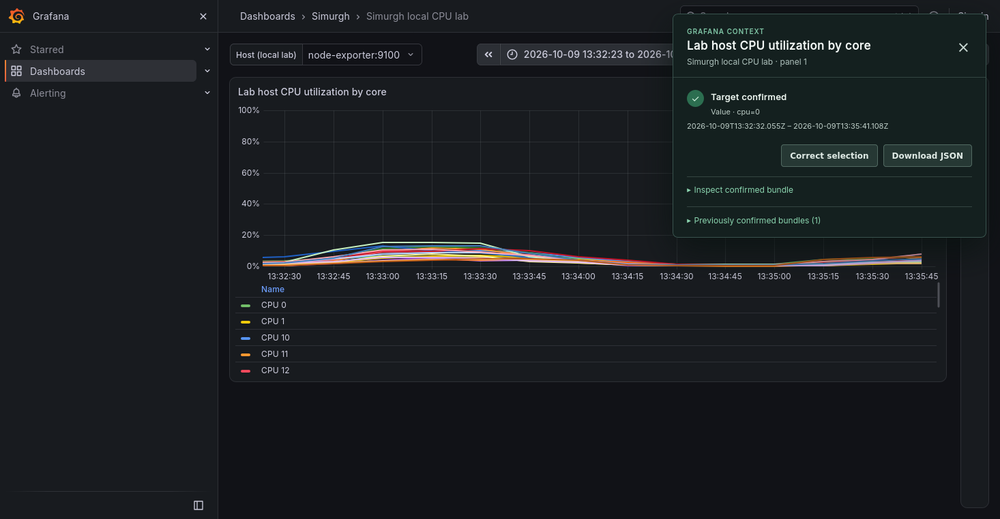
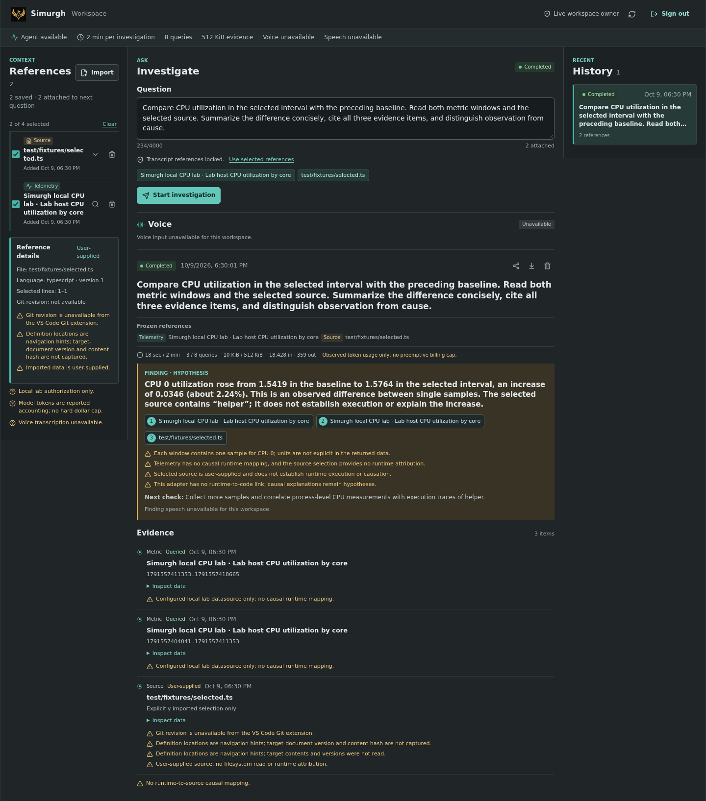

# Simurgh

<p align="center">
  
</p>

Simurgh is an early-stage context inspector for observability dashboards. Phase 1 connects a browser selection to the identity and data of a Grafana panel, then lets the user inspect and confirm that captured context. A separate same-machine workspace/coordinator is experimental; one targeted cross-surface acceptance passed for a pinned local configuration, but this does not qualify other machines or production use.

The README logo uses the supplied centered SVG with its full-canvas background and detached lettering remnant removed. Original SVG and PNG files are retained byte-for-byte; see [brand asset provenance](assets/brand/README.md).

This project is licensed under the [Apache License 2.0](LICENSE). See [NOTICE](NOTICE), [CONTRIBUTING.md](CONTRIBUTING.md), and [SECURITY.md](SECURITY.md).

See [Phase 1 status](docs/phase1-status.md) for the current selection flow, evidence boundaries, and acceptance status.

See the [0.0.1 experimental release notes](docs/releases/0.0.1.md) for version-specific scope and limitations.

## See the workflow

### Confirm the dashboard context

Select a region, choose the intended series, and explicitly confirm it. Here the Firefox inspector shows a confirmed CPU 0 selection from the local Grafana lab, with the selected interval and JSON export available.



### Investigate with evidence

The dark-mode local workspace brings a confirmed telemetry reference and a reviewed source selection into one bounded investigation. This completed live run compares the selected interval with its baseline, cites three evidence items, and keeps the missing causal link between source code and CPU behavior explicit.



These are actual local MVP captures, not mockups or customer data. The source reference is a test fixture; it is not evidence that this code caused the observed CPU behavior. Screenshots illustrate the workflow, not production qualification. [Capture details](docs/screenshots/README.md).

## Experimental local MVP

The same-machine workspace can import confirmed dashboard or reviewed source references, run bounded evidence reads, share investigation records with explicit local grants, and optionally use CPU-only local speech. This is a developer MVP, not a hosted service or production deployment. Follow the [local MVP runbook](docs/local-mvp.md) for setup and its current verification boundaries.

## Local Grafana lab

The included Docker lab pins Grafana 13.2.3, Prometheus, and node-exporter by version and image digest. It supplies CPU telemetry and an optional bounded workload. This is a development fixture, not a customer environment or a Windows host monitor.

## Start

From the repository root:

```sh
npm ci
npm run build
docker compose -f infra/compose.yaml config
docker compose -f infra/compose.yaml up -d
```

Grafana is published only on `127.0.0.1:3300`. Open [http://127.0.0.1:3300](http://127.0.0.1:3300). The provisioned dashboard is **Simurgh local CPU lab**, UID `simurgh-cpu-lab`, panel ID `1`. Anonymous access is limited to Grafana's Viewer role. For administration, the local lab login is `admin` / `simurgh-local-only`; do not reuse it elsewhere.

The app plugin is mounted read-only from `packages/grafana-plugin/dist`, its ID is `simurgh-context-app`, and Grafana allows that unsigned plugin only in this lab. Build the plugin before starting Grafana. This local unsigned development build is not release-ready or trusted by virtue of the allow-list. Do not copy the lab allow-list setting into a customer or production Grafana.

Load the built extension in Chromium from `chrome://extensions`: turn on **Developer mode**, choose **Load unpacked**, and select `packages/chromium-extension/dist`. Review the requested host permissions and approve only the loopback Grafana origin used by this lab; do not grant broad site access. Open the local CPU dashboard, drag across the chart's time axis to use Grafana's native range zoom, then open the panel menu and choose **Inspect with Simurgh**. Review the available CPU series and selected interval, choose the intended series, and confirm the target. The extension lets you inspect the confirmed bundle and download it as JSON. This is the accepted baseline selection flow. The panel menu also exposes an experimental **Freehand with Simurgh** prototype for Grafana 13.2.3/uPlot 1.6.32: establish a stable range with native zoom first, then open that action, choose **Draw**, trace a region, select a matched series, and confirm. The combined local browser checks passed; this version-pinned instrumentation is not a supported or production workflow and has not been validated for mobile touch drawing or other renderer versions. A real deployment must configure and authorize its exact Grafana origin separately.

The separate Firefox MV3 build is in `packages/chromium-extension/dist-firefox`. It can be temporarily loaded from `about:debugging#/runtime/this-firefox` using **Load Temporary Add-on**; it is removed when Firefox restarts and is not a signed end-user release. Do not disable signature enforcement. Firefox 157.0.1 passed the real Grafana freehand flow, API sample matching, download/refresh immutability, wrong-port rejection, and resize invalidation/rebind. The layout check ran at Firefox's clamped 500px width, not 390px. See the [Firefox guide](docs/firefox.md) for exact limits.

Freehand pauses dashboard auto-refresh while the target is being drawn and reviewed, then restores the prior interval on confirmation, close, or terminal failure. It preserves the selected time range and variables, and does not override a manual refresh change. You still need an absolute time range and a completed panel result; stale or loading captures are rejected.

## CPU workload

The default stack does not run the load generator. Start its capped container when a visible workload is useful:

```sh
docker compose -f infra/compose.yaml --profile load up -d cpu-load
```

It is limited to 0.50 CPU, 32 MiB memory, and 16 processes. Stop it with:

```sh
docker compose -f infra/compose.yaml --profile load stop cpu-load
```

Remove the stack with `docker compose -f infra/compose.yaml down`.

## Telemetry meaning and limits

The monitored kernel depends on where Docker Engine runs. With Docker Desktop, including on Windows, containers run in Docker Desktop's Linux VM, so node-exporter reports that VM's Linux kernel CPU counters. With native Linux Docker, it reports the Linux host kernel. This lab does not report Windows CPU or represent a customer host. Node-exporter reads only the Docker Engine host's `/proc` through a read-only bind mount and has its default collectors disabled except CPU; the target uses generic `job="simurgh-lab-host"` and `telemetry_host="simurgh-lab-host"` labels. No Windows filesystem, Docker socket, secrets, privileged mode, or broad host-root mount is used. The optional workload is also a container and can perturb the Docker Engine host's CPU readings. Customer installations must use an authorized Prometheus-compatible datasource and real environment labels; the fixture labels are not evidence about another environment.

Prometheus scrapes every 5 seconds. Panel query rate window is 1 minute. Each plotted series is one logical CPU core, computed as `100 * (1 - sum by (cpu) (rate(node_cpu_seconds_total{job="simurgh-lab-host", telemetry_host="simurgh-lab-host", instance=~"$host", mode="idle"}[1m])))`. This is per-core busy percentage from idle time, not container CPU usage. A selected short interval or a displayed line does not establish finer event duration than the scrape and rate window support. Per-core series are intentionally preserved; when multiple series are present, the user must select the intended series explicitly.

Prometheus and node-exporter are only reachable on the Compose network; Grafana is the sole published service. Datasource UID: `prometheus-local`, using internal URL `http://prometheus:9090`.
Grafana's baked-in plugin preinstall list and plugin update checks are disabled in this lab so startup does not fetch unrelated plugins or depend on Grafana's plugin catalog. The local `simurgh-context-app` directory is supplied by the read-only bind mount and provisioned as enabled.

## Development checks

Use Node.js 20.19 or newer and npm 10 or newer from the repository root:

```sh
npm ci
npm test
npm run typecheck
npm run build
npx playwright install chromium
npm run test:browser
```

Run the browser check with the local lab running; it exercises native time-range selection, candidate ambiguity, confirmation/correction, and snapshot stability. GitHub Actions runs these commands and provisions the lab for the browser check. See [CONTRIBUTING.md](CONTRIBUTING.md) for change expectations.
